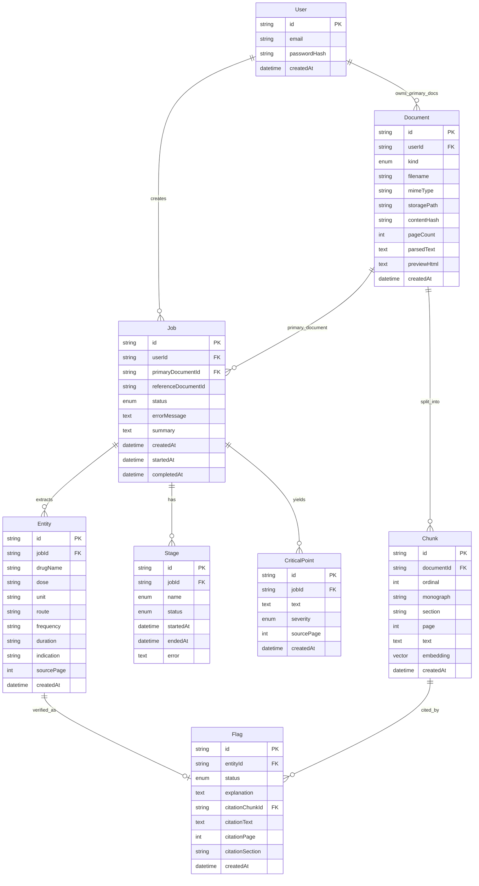

# Document Verification System

Full-stack medical document verification: ingest a primary document (hospital discharge summary) and verify prescribed medications against an institutional formulary (reference document) using retrieval-augmented generation.

**Domain:** Medical — prescribed medications verified against an institutional formulary.

**Pipeline stages:** `PARSE → CHUNK → EMBED → SUMMARIZE → CRITICAL_POINTS → EXTRACT → VERIFY`

## Tech stack

| Layer | Choice | Rationale |
|-------|--------|-----------|
| Backend | NestJS (TypeScript) | Modular stages, DI, structured logging |
| Frontend | React + Vite + Tailwind | Fast dev UX, component model for split document view |
| Database | PostgreSQL + pgvector | Relational job/user model + vector similarity in one store |
| Queue | BullMQ + Redis | Non-blocking upload; durable async pipeline |
| ORM / migrations | Prisma | Versioned SQL migrations under `backend/prisma/migrations/` |
| Embeddings | `@xenova/transformers` (`all-MiniLM-L6-v2`) | Local, no API cost; 384-dim matches `vector(384)` column |
| LLM | Anthropic or OpenAI (configurable) | Structured JSON for summary, critical points, extraction, verification |
| Auth | JWT bearer tokens | Stateless; owner checks on every document/job read |

## Provided assets

Assignment documents live under `backend/assets/`:

- `primary_document.docx` - discharge summary with deliberate prescribing errors
- `reference_document.docx` - institutional formulary digest (monographs + retrieval haystack)

The seed script parses and indexes the reference on first startup.

## Quick start

### Prerequisites

- Docker Desktop
- One LLM API key (Anthropic or OpenAI)

### Environment

Create `.env` in the repository root:

```env
POSTGRES_USER=docverify
POSTGRES_PASSWORD=docverify_dev
POSTGRES_DB=docverify
JWT_SECRET=change-me-min-16-chars
LLM_PROVIDER=anthropic
ANTHROPIC_API_KEY=your-real-key
```

For OpenAI:

```env
LLM_PROVIDER=openai
OPENAI_API_KEY=your-real-key
```

Optional:

```env
DEDUP_WINDOW_MS=300000   # duplicate upload window (default 5 min)
SEED_USER_EMAIL=demo@meridianbay.test
SEED_USER_PASSWORD=demo1234
```

### Run the stack

```bash
docker compose up --build
```

On startup the stack:

1. Starts Postgres (`pgvector`) and Redis
2. Runs versioned migrations (`prisma migrate deploy`)
3. Seeds the demo user, reference document, and reference embeddings
4. Starts the backend API (with embedded BullMQ worker) and frontend

### Demo login

- **Email:** `demo@meridianbay.test`
- **Password:** `demo1234`

### URLs

- Frontend: [http://localhost:5173](http://localhost:5173)
- Backend API: [http://localhost:3001/api](http://localhost:3001/api)
- Swagger: [http://localhost:3001/api/docs](http://localhost:3001/api/docs)

Upload `backend/assets/primary_document.docx` (or any PDF/DOCX discharge summary) and select the seeded formulary reference.

---

## Architecture

- **Asynchronous pipeline:** `POST /documents/upload` returns `{ jobId, documentId }` immediately. `PipelineProcessor` (BullMQ) runs stages without blocking HTTP.
- **Realtime status:** Frontend subscribes to job events via **Server-Sent Events** (`GET /api/jobs/:id/stream`). Polling was not used - SSE gives push updates with low complexity. Refreshing the status page mid-run re-fetches persisted `Stage` rows, so progress is not lost.
- **Per-stage observability:** Each stage is a named row (`PARSE`, `CHUNK`, …) with `PENDING → RUNNING → COMPLETED | FAILED`, timestamps, and error text. Failures mark the stage and job failed; the worker does not hang.
- **User isolation:** Primary documents are scoped by `userId`. Jobs and previews enforce ownership. Reference documents (`kind = REFERENCE`) are shared read-only across authenticated users.
- **RAG verification:** Entities retrieved against reference chunks in pgvector; LLM classifies with citations grounded in retrieved text.


---

## Design decisions

### Verification: Supported / Contradicted / Unsupported

The reference formulary is ground truth. For each extracted medication entity, the system assigns one of three states:

| Status | Meaning |
|--------|---------|
| **SUPPORTED** | Reference has a monograph for this drug; prescribed dose, frequency, duration, route, and timing are consistent with the monograph. |
| **CONTRADICTED** | Reference has a monograph, but one or more parameters conflict (dose over max, wrong frequency/timing, duration over institutional limit, contraindicated indication, etc.). |
| **UNSUPPORTED** | No relevant monograph in the reference for this drug. |

**Why three states instead of pass/fail:** Clinicians need to distinguish “wrong per formulary” from “not in formulary at all” different actions (change prescription vs. escalate / off-formulary approval).

**How parameters are compared:** The LLM prompt requires checking dose, frequency, duration, route, and timing not drug name alone. The retrieval query includes `drugName + dose + frequency + duration` so embeddings land on parameter-relevant monograph text, not just the drug header.

**Relevance gate (before LLM):** If the top retrieved chunk has cosine distance > `0.45`, we skip the LLM and mark **UNSUPPORTED** immediately. Empirically, real formulary drugs score ~0.15–0.25; unrelated drugs ~0.50+. This prevents the model from inventing a verdict when retrieval found nothing useful.

**Citation grounding (after LLM):** `citation_quote` must appear verbatim in one of the top-3 retrieved chunks (normalized substring match). If not, the flag is stored without a chunk link and the explanation notes weak grounding. Page/section on flags come from chunk metadata (`monograph`, `section`) for maximum reference-level citation.

**Conservative contradictions:** Prompt instructs the model to choose SUPPORTED unless specific reference text conflicts reduces false positives on ambiguous monographs.

### Critical points

**Definition:** Patient-facing items they must not miss time-specific dosing, duration limits, report-immediately side effects, follow-up timing, activity restrictions. Drawn only from the primary document.

**Ranking:** LLM assigns `HIGH | MEDIUM | LOW` with explicit severity guidance in the prompt (harm risk vs. outcome degradation vs. general guidance). Post-processing sorts HIGH → MEDIUM → LOW for display. Cap of 10 points after validation; quality over quantity.

**Hallucination control:** Every point requires a `source_quote` that must appear in `parsedText` (normalized substring). Ungrounded points are dropped. Generic advice (“take meds as prescribed”) is forbidden in the prompt.

### RAG: chunking strategy

Chunking differs by document kind because structure differs:

| Document | Strategy | Why |
|----------|----------|-----|
| **Reference** | One chunk per drug monograph | Formulary is discrete monographs; splitting would separate dose from constraints (e.g. Etrazolam 4-week max lives in the same block as standard dose). |
| **Primary** | Paragraph-based, ~500 char target | Discharge summary is prose + table; paragraphs give summarization context without arbitrary mid-sentence cuts. |

Reference chunking uses a line heuristic: Roman-numeral section headers, then drug-name lines (e.g. `Etrazolam`) start a new monograph. Seeded reference is indexed once at startup via `ReferenceIndexer`.

Primary chunks are embedded during the pipeline `EMBED` stage; reference chunks are pre-embedded at seed time.

### RAG: embedding model

**Model:** `Xenova/all-MiniLM-L6-v2` (384 dimensions, mean-pooled, L2-normalized).

**Why local MiniLM:** Fast cold start in Docker, no embedding API cost/latency, sufficient for short monograph-sized chunks. Cosine distance via pgvector `<=>` on an HNSW index (`migrations/…_add_chunk_embedding_hnsw_index`).

**Tradeoff:** General-purpose English embeddings, not domain-fine-tuned for clinical text. Monograph-level chunks mitigate this by keeping each vector self-contained.

### Retrieval evaluation strategy

Verification uses **top-K=3** chunks per entity, scoped to `referenceDocumentId` only.

**Manual smoke test** - from `backend/`:

```bash
npx dotenv-cli -e ../.env -- ts-node scripts/test-retrieval.ts
```

Runs fixed queries (known drugs + fictional `Pranixol`) and prints monograph + cosine distance. Used to calibrate `RELEVANCE_DISTANCE_THRESHOLD = 0.45`.

**Automated check:** `verify.stage.spec.ts` asserts weak retrieval (distance 0.62, unrelated monograph) → `UNSUPPORTED` without trusting LLM output.

**What we did not build:** Formal precision/recall benchmarks or labeled qrels. With more time: a small golden set of (entity, expected_monograph) pairs and retrieval@1/@3 metrics in CI.

### Entity extraction

Structured JSON: `drugName`, `dose`, `unit`, `route`, `frequency`, `duration`, `indication`, `sourcePage`, plus `source_quote` for grounding. Post-LLM validation drops entities whose quote is not in the document. Schema enforced with Zod; temperature 0.

### Hallucination control (summary)

| Stage | Control |
|-------|---------|
| Summary | Faithful overview prompt; full document as context; temperature 0 |
| Critical points | `source_quote` must exist in document |
| Extract | `source_quote` must exist in document |
| Verify | Retrieval gate + passages-only prompt + citation substring check |

If no relevant reference passage, system says so (`UNSUPPORTED`) rather than guessing.

### Auth

Email + password signup/login. Passwords hashed with bcrypt. JWT in `Authorization: Bearer`. No password reset / OAuth / 2FA (out of scope).

### Frontend

- **Login / signup** with error states
- **Upload:** drag-and-drop (react-dropzone), PDF/DOCX validation, 5 MB cap, reference selector
- **Optimistic UI:** `location.state` carries filename/reference label to the status page before the first SSE payload arrives
- **Pipeline view:** live stages with timestamps via SSE; survives refresh
- **Document view:** primary HTML preview (parsed DOCX/PDF) left; summary, critical points, flagged issues right
- **Citations:** modal preview with highlighted quote; **View in reference** navigates to `/reference/:jobId` with deep-link highlight
- Loading, empty, and error states on all main routes

---

## Data integrity and transactions

### Inside the transaction (`prisma.$transaction`)

On successful parse, a single transaction creates atomically:

1. `Document` (PRIMARY) - metadata, `contentHash`, `parsedText`, `previewHtml`
2. `Job`  `QUEUED`, links primary + selected reference
3. All seven `Stage` rows - `PENDING`, so the UI can render the full pipeline immediately

If any insert fails, the transaction rolls back no orphan job without document, no partial stage set.

### Outside the transaction (and why)

| Step | Outside TX | Reason |
|------|------------|--------|
| File write to disk | Before TX | Need `contentHash` and parsed content first; file deleted on parse/validation failure |
| Document parse | Before TX | Expensive; avoid holding DB locks during I/O |
| BullMQ enqueue | After TX commit | Queue is separate system; job row exists before worker picks it up |
| Duplicate-upload short-circuit | Before TX | Returns existing `jobId` if same user + `contentHash` + reference within `DEDUP_WINDOW_MS` |

**Enqueue failure:** If Redis enqueue fails after commit, job stays `QUEUED` in DB documented limitation; manual retry possible.

**Rollback file cleanup:** On transaction failure after disk write, `storage.tryDelete` removes the orphaned file.

---

## Schema (ERD)



Migrations: `backend/prisma/migrations/` (versioned, applied on container start).

---

## Multiple reference documents

The repo ships one institutional formulary by default; the schema and UI support more without migrations.

### How it works

- Reference documents are `documents` rows with `kind = REFERENCE` (no owning user).
- Each job stores `referenceDocumentId`; retrieval and verification are scoped to that document only.
- Upload page loads references from `GET /api/documents/references`.
- With one reference, it is auto-selected; with several, the user chooses from a dropdown.

### Add another formulary

1. Place the file under `backend/assets/` (e.g. `pediatric_formulary.docx`).
2. Extend `backend/prisma/seeds.ts` to parse and index it (same pattern as `reference_document.docx`):
   - Parse → create `Document` with `kind: REFERENCE` (idempotent by `contentHash`)
   - Call `ReferenceIndexer.indexReference({ documentId, parsedText })`
3. Run `cd backend && npm run prisma:seed` (pass `--force` to rebuild embeddings).
4. Restart the app; the new formulary appears in the upload dropdown.

---

## Extra credit attempted

| Feature | Status | Notes |
|---------|--------|-------|
| **Deep-link citations** | Done | Flagged issue → modal or `/reference/:jobId` with `highlightCitationInElement` on formulary HTML |
| **Duplicate upload detection** | Done | SHA-256 `contentHash`; same user + reference within `DEDUP_WINDOW_MS` (default 5 min) returns existing job |
| **Multiple references** | Done | Schema + API + UI dropdown; seed path documented above |

### With more time

- Separate BullMQ worker container in `docker-compose.yml`
- In-app reference upload / admin indexing (today: seed/assets only)
- Formal retrieval benchmark suite in CI
- PDF page numbers on citations (DOCX preview lacks stable pages today)
- Broader e2e tests (upload → pipeline → results)
- Password strength policy and rate limiting on auth

---

## Logging and traceability

Structured JSON logs per pipeline path:

- `pipeline.ingestion.accepted` / `pipeline.ingestion.failed` / `pipeline.ingestion.deduped`
- `pipeline.extraction.completed`
- `pipeline.retrieval.completed`
- `pipeline.verification.entity_completed`
- Stage lifecycle: `pipeline.stage.started` | `completed` | `failed`

Stable fields: `jobId`, `userId`, `documentId`, `entityId`, `drugName`, `stage`. Trace one document end-to-end by filtering logs on `jobId`.

---

## Tests

From `backend/`:

```bash
npm test -- verify.stage.spec.ts
npm test -- documents.service.spec.ts
```

Coverage focus:

- **Verification:** Known-contradicted scenario → `CONTRADICTED`; weak retrieval → `UNSUPPORTED` (no LLM hallucination path)
- **Authorization:** Primary document preview owner-only; references readable by any authenticated user

Broad coverage was intentionally deferred given the 3-day budget; these tests demonstrate correctness thinking on the highest-risk paths.

---

## Backend API reference

Swagger UI: `/api/docs`.

- Public: `POST /api/auth/login`, `POST /api/auth/signup`
- Protected (JWT): all `documents` and `jobs` endpoints

In Swagger: login → copy `token` → **Authorize** → `Bearer <token>`.

---

## Tradeoffs and known limitations

- **Worker colocation:** API and BullMQ worker run in one backend process (no separate worker service in compose).
- **Enqueue after commit:** Queue failure leaves job `QUEUED` in DB without a running worker job until retried.
- **Reference indexing:** New formulary via seed/assets only, not end-user upload.
- **Embedding model:** General-purpose MiniLM, not clinical-tuned.
- **Page-level citations:** DOCX-derived HTML preview; `sourcePage` often null for critical points/entities.
- **Parse dependency:** Upload requires successful parse before DB transaction; very large or malformed files fail early with cleanup.

---

## Local development (without Docker)

```bash
# Terminal 1 — infrastructure
docker compose up postgres redis

# Terminal 2 — backend
cd backend && npm install && cp ../.env .env
npx prisma migrate deploy && npm run prisma:seed
npm run start:dev

# Terminal 3 — frontend
cd frontend && npm install && npm run dev
```

Requires Node 20+, same `.env` keys as Docker.
