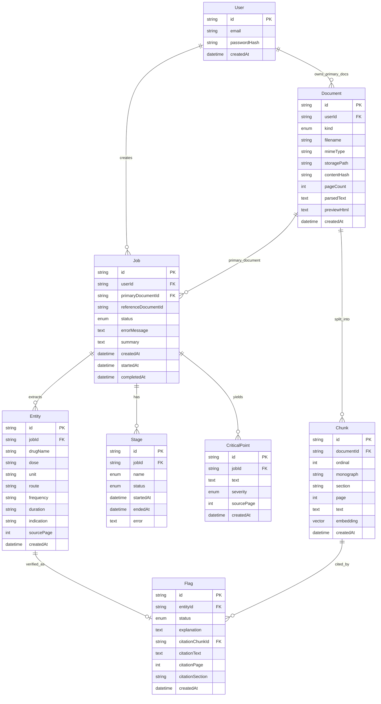
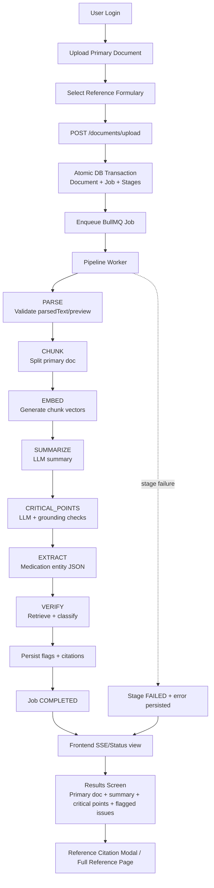

## Document Verification System

Full-stack medical document verification app with async pipeline stages:
`PARSE -> CHUNK -> EMBED -> SUMMARIZE -> CRITICAL_POINTS -> EXTRACT -> VERIFY`.

### Features

- Structured pipeline logs for ingestion, extraction, retrieval, and verification with stable fields (`jobId`, `userId`, `documentId`, `entityId`, `drugName`, `stage`).
- Targeted tests around verification correctness and authorization boundaries.
- Single `docker-compose.yml` for database, cache, backend, and frontend.
- Seeded demo user and institutional formulary for immediate login and upload.

## Quick start

### Prerequisites

- Docker Desktop
- One LLM API key (Anthropic or OpenAI)

### Environment

Create `.env` in the repository root:

```env
POSTGRES_USER=docverify
POSTGRES_PASSWORD=docverify_dev
POSTGRES_DB=docverify
JWT_SECRET=change-me-min-16-chars
LLM_PROVIDER=anthropic
ANTHROPIC_API_KEY=your-real-key
```

For OpenAI:

```env
LLM_PROVIDER=openai
OPENAI_API_KEY=your-real-key
```

### Run the stack

```bash
docker compose up --build
```

On startup the stack:

1. Starts Postgres (`pgvector`) and Redis
2. Runs backend migrations (`prisma migrate deploy`)
3. Seeds the demo user, reference document, and reference embeddings
4. Starts the backend API and frontend

### Demo login

- Email: `demo@meridianbay.test`
- Password: `demo1234`

### URLs

- Frontend: [http://localhost:5173](http://localhost:5173)
- Backend API: [http://localhost:3001/api](http://localhost:3001/api)
- Swagger API reference: [http://localhost:3001/api/docs](http://localhost:3001/api/docs)

## Backend API reference

Swagger UI is available at `/api/docs`.

- Auth endpoints (`/api/auth/login`, `/api/auth/signup`) are public.
- All `documents` and `jobs` endpoints require a JWT bearer token.
- In Swagger UI:
  1. Call `POST /api/auth/login`.
  2. Copy the returned `token`.
  3. Click **Authorize** and paste `Bearer <token>`.
  4. Call protected endpoints directly from docs.

## Tests

From `backend/`:

```bash
npm test -- verify.stage.spec.ts
npm test -- documents.service.spec.ts
```

These cover:

- Verification: contradicted medications flagged as `CONTRADICTED`; weak retrieval gated to `UNSUPPORTED`
- Authorization: primary document preview is owner-only; reference documents are readable by any authenticated user

## Logging and traceability

The backend emits structured JSON logs for the main pipeline paths:

- `pipeline.ingestion.accepted` / `pipeline.ingestion.failed`
- `pipeline.extraction.completed`
- `pipeline.retrieval.completed`
- `pipeline.verification.entity_completed`
- Stage lifecycle: `pipeline.stage.started|completed|failed`

Each event includes enough context to trace a single document end-to-end by `jobId` and locate failures quickly.

## Architecture

- **Asynchronous pipeline:** BullMQ worker (`PipelineProcessor`) processes jobs without blocking upload HTTP requests.
- **Realtime status:** Frontend consumes job status via SSE; refreshing mid-run preserves stage progress.
- **Atomic ingest:** `DocumentsService.ingestUpload()` creates `Document`, `Job`, and all `Stage` rows in one transaction.
- **RAG verification:** Extracted entities are retrieved against reference chunks in pgvector and classified as `SUPPORTED`, `CONTRADICTED`, or `UNSUPPORTED`, with citation grounding checks.

## ERD



## System Workflow Diagram



## Multiple reference documents

The repo ships one institutional formulary by default; the schema and UI support more without migrations.

### How it works

- Reference documents are `documents` rows with `kind = REFERENCE` (no owning user).
- Each job stores `referenceDocumentId`; retrieval and verification are scoped to that document only.
- The upload page loads references from `GET /api/documents/references` and sends the selected id with the primary file.
- With one reference, it is auto-selected; with several, the user chooses from a dropdown.
- Citations open in a modal preview; a full-page view is available for deep links.

### Add another formulary

1. Place the file under `backend/assets/` (e.g. `pediatric_formulary.docx`).
2. Extend `backend/prisma/seeds.ts` to parse and index it (same pattern as `reference_document.docx`):
   - Parse → create `Document` with `kind: REFERENCE` (idempotent by `contentHash`)
   - Call `ReferenceIndexer.indexReference({ documentId, parsedText })`
3. Run `cd backend && npm run prisma:seed` (pass `--force` to the indexer when rebuilding embeddings).
4. Restart the app; the new formulary appears in the upload dropdown.

No migration is required only seed/index work.

## Tradeoffs and known limitations

- Enqueue runs after the DB commit: if the queue write fails, the job stays `QUEUED` and can be retried manually.
- One backend process hosts both the API and the BullMQ worker (no separate worker container).
- New references are added via seed/assets, not through an in-app admin upload flow.
